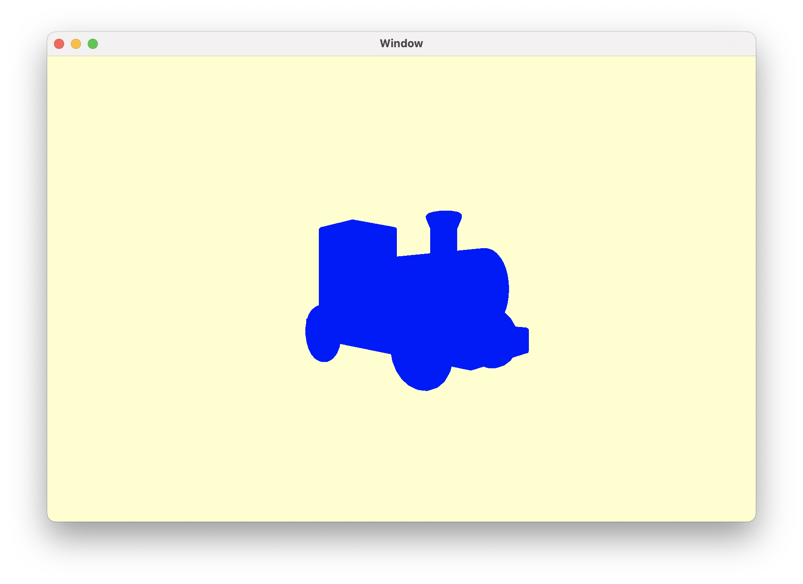
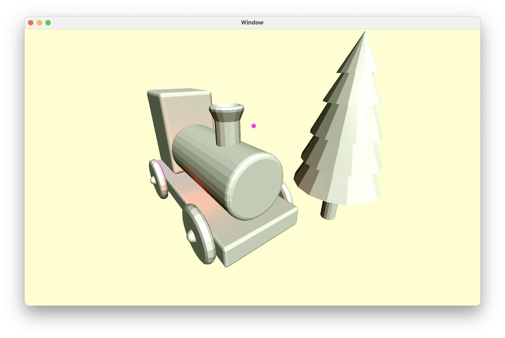
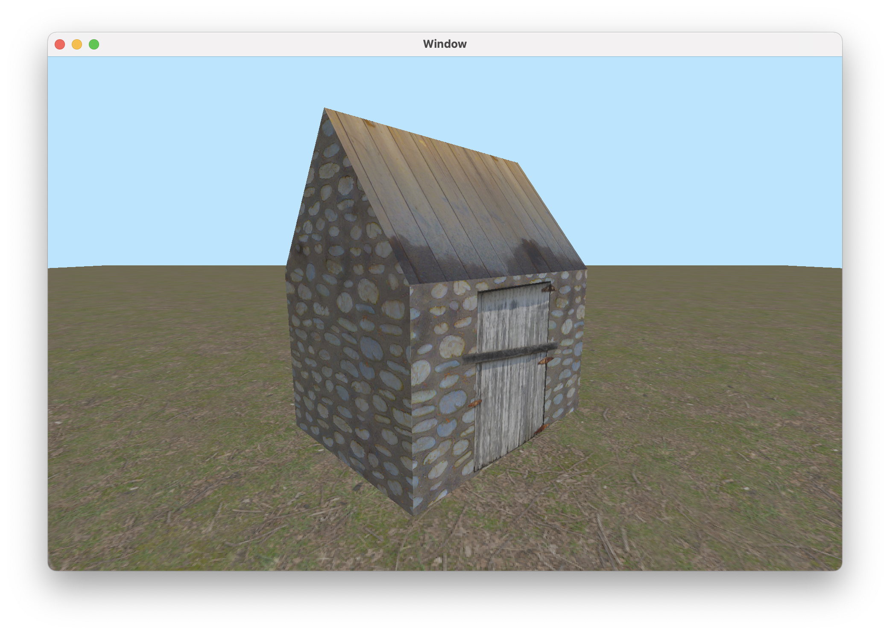
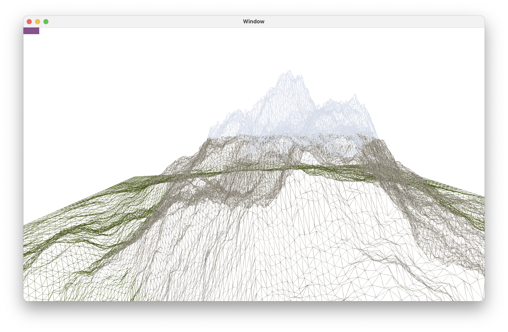
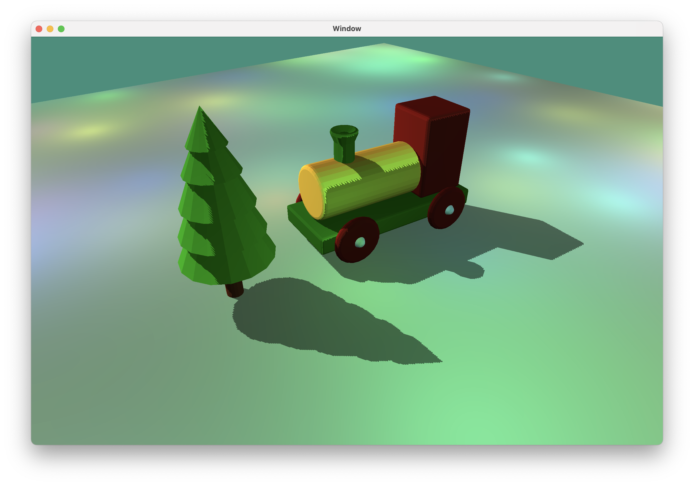

# Computer-Graphics

## Proprietary Game Engine's Render Core based on Metal API

### Rendering Pipeline

### Transformation

### Lighting

### Texturing

### Maps & Materials

### Animations

### Tesselation

### Multipass & Deferred Rendering

### Particle System

### Percentage Closer Filtering Shadow Maps

### Advanced Lighting

### Metal Performance Shaders [Bloom VFX]

